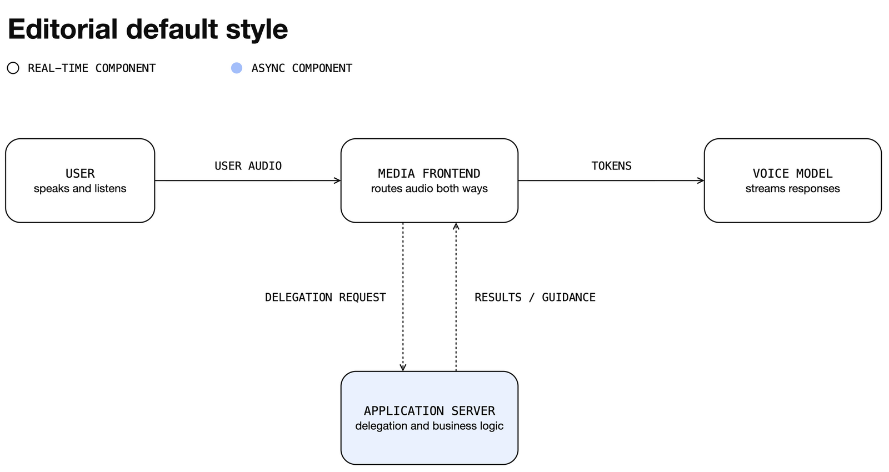

# drawio-agent-skill

Editorial figure skills for coding agents: diagrams and data charts that share
one visual language.

This repo packages two skills under `skills/`:

| Skill | Draws | Tool |
| --- | --- | --- |
| [`drawio-diagram`](skills/drawio-diagram/SKILL.md) | Structure: boxes, arrows, layers, flowcharts, schematics | native `.drawio` XML, editable after the first pass |
| [`editorial-chart`](skills/editorial-chart/SKILL.md) | Measured data: line, bar, scatter, dot-plot charts | matplotlib → SVG (text preserved) + PNG |

The routing rule between them: if the figure's content is *measured data*
(real numbers, many points, true scales), it is a chart; if it is *structure*,
it is a diagram. Both render the same editorial style, so a document that
mixes diagrams and charts still reads as one system.

## Install

Install through the Skills CLI. The `--agent` value selects the target
harness; manual paths and restart behavior stay in the corresponding install
guide ([Claude Code](.claude/INSTALL.md), [Codex](.codex/INSTALL.md),
[Cursor](.cursor/INSTALL.md), [Gemini CLI](.gemini/INSTALL.md)).

```bash
npx skills add gigio1023/drawio-agent-skill@drawio-diagram --agent claude-code
npx skills add gigio1023/drawio-agent-skill@editorial-chart --agent claude-code
```

Swap `--agent` for `codex`, `cursor`, or `gemini-cli` as needed. Install only
the skills you want; each command is independent.

## Usage

Ask naturally; explicit invocation (`/drawio-diagram`, `/editorial-chart` in
Claude Code, `$`-prefixed in Codex) is optional when the request is clear.

```text
Make a draw.io architecture diagram for this ingestion pipeline.
Turn this research section into a compact editorial figure in draw.io.
Plot these benchmark scores as an editorial-style bar chart.
Chart success rate vs step budget (log x) from results.csv.
```

## The shared visual style



White canvas, near-black ink, one accent color family per page, and two text
voices (monospace entity labels, sans titles and commentary). Diagrams add
soft ~16px corners and thin open arrowheads; charts add gridless ink axes,
chip legends, and mono numerals. Token sets:
[`editorial-default-style.md`](skills/drawio-diagram/references/local/editorial-default-style.md)
for diagrams,
[`chart-language.md`](skills/editorial-chart/references/chart-language.md)
for charts. Alternative palettes remain available on request
([`color-palettes.md`](skills/drawio-diagram/references/local/color-palettes.md)).

**Style attribution.** This style is deliberately modeled on the editorial
figure language used in OpenAI's blog posts since their February 2025 rebrand
(openai.com engineering and research posts); its tokens were measured from 65
published figure SVGs (provenance:
[`reference-set.md`](skills/drawio-diagram/references/local/reference-set.md)).
It is an independent re-implementation of generic design elements - palette
values, spacing, stroke and corner geometry, typographic structure. It
intentionally excludes OpenAI's identity: no OpenAI logo, blossom mark, or
wordmark ever appears in output, and the proprietary OpenAI Sans typeface is
replaced with Inter and IBM Plex Mono stacks. This project is not affiliated
with or endorsed by OpenAI, and figures produced with it must not claim to be.

# drawio-diagram

Native draw.io authoring guidance. Its job is not just to produce valid XML,
but native `.drawio` files that stay readable, editable, and structurally
intact under review. All paths below are relative to
[`skills/drawio-diagram/`](skills/drawio-diagram/).

The skill has four explicit layers:

1. fetched upstream copies (committed digests)
2. optional local clones of official docs and examples (gitignored)
3. local overlay
4. deterministic validators

The fetched upstream layer keeps verbatim `jgraph/drawio-mcp` content inside
this repo at stable local paths for provenance and technical lookup. It is not
loaded wholesale as agent policy: the local overlay controls workflow, layout
judgment, and verification. The validators turn repeated visual bugs into
checks the agent can run before claiming success.

## Fetched upstream copies

Fetched files live under `references/fetched/`:

- `xml-reference.md`
- `style-reference.md`
- `mermaid-reference.md`
- `mxfile.xsd`
- `skill-cli-README.md`
- `skill-cli-drawio-SKILL.md`

Refresh them with:

```bash
python3 scripts/vendor_jgraph_drawio_mcp.py
```

The resolved commit and fetch timestamp are recorded in
`references/fetched/vendor-manifest.json`. The local repo layout does not
mirror the upstream folder tree. The fetch script copies upstream files into
stable local filenames, so local references do not churn just because the
upstream directory layout changes.

## Local overlay

Local guidance lives under `references/local/`. Key files:

- `editorial-default-style.md` - the default visual style; applies whenever
  the user names no style, seeded by `assets/editorial-default-template.drawio`
- `upstream-drawio-rules.md` - local digest of the structural rules that always apply
- `edge-routing.md` - connection contract, fixed vs floating terminals, waypoint
  recipes, and why draw.io never routes around other shapes
- `text-and-labels.md` - line breaks (`\n` renders literally), escaping, label
  positioning, and detail-vs-compact representation levels
- `color-palettes.md` - alternative palettes used on request plus dark-mode
  rules; the default palette lives in `editorial-default-style.md`
- `figure-grammars.md` - one-grammar-per-page layout discipline
- `layout-safety.md` - overlap, padding, and corridor checks
- `quality-gates.md` - hard finishing gates for meaning, layout, text, arrows, and corner consistency
- `real-world-gotchas.md` - repeated failure modes from real sessions
- `review-loop.md` - exported-artifact QA, arrow-corridor audit, and SVG/PNG review guidance
- `visual-patterns.md` - compact visual behaviors from selected official references
- `upstream-docs-map.md` - map of the official docs/example clones and what the
  official diagrams actually do with edges
- `reference-set.md` - provenance for those references
- `community-lessons.md` - lessons from adjacent ecosystems

## Official docs and examples (optional local clones)

For deep lookup beyond the vendored digests, clone the official sources into
`references/upstream/` (gitignored, never committed):

```bash
bash scripts/fetch_upstream_docs.sh                    # drawio-mcp + drawio-diagrams (~30MB)
bash scripts/fetch_upstream_docs.sh --with-mxgraph     # + archived mxGraph docs
bash scripts/fetch_upstream_docs.sh --with-app-templates  # + app templates (CC BY 4.0)
```

`references/local/upstream-docs-map.md` maps questions to locations in the
clones and lists the equivalent online URLs when clones are absent.

## Validators

Two validators ship with the skill (run inside `skills/drawio-diagram/`):

```bash
python3 scripts/validate_drawio_xml.py path/to/file.drawio
python3 scripts/validate_drawio_layout.py path/to/file.drawio
python3 -m unittest discover -s scripts -p 'test_*.py'
```

What they catch:

- broken root structure
- duplicate ids
- missing edge geometry
- missing `html=1`
- XML comments
- framed component overlap
- child overflow from parent containers
- border-hugging text risk
- inconsistent rounded-rectangle settings
- dangling edges (no source/target and no explicit end point)
- edge routes that likely cross unrelated components
- fixed connection points facing away from the other terminal
- floating edge pairs between the same two shapes (they render overlapped)
- edge labels without an opaque background
- one/two-waypoint doglegs between aligned terminals when the direct corridor is clear

They are not a replacement for opening the diagram, but they close the gap
between "XML is valid" and "diagram is still broken." For review handoffs, the
skill also points agents to inspect the exported SVG or normalized
high-resolution PNG.

## Export behavior

The skill writes `.drawio` by default. If the draw.io CLI is available, it can
also export `.drawio.png`, `.drawio.svg`, and `.drawio.pdf`. Unlike upstream
`skill-cli`, this repo keeps the `.drawio` source after export.

For 4K review PNGs:

```bash
drawio -x -f png -e -b 10 --width 3840 -o diagram.drawio.png diagram.drawio
```

Prefer SVG when text crispness matters more than bitmap convenience.

## Troubleshooting

| Problem | Fix |
| --- | --- |
| draw.io CLI not found | Install draw.io Desktop or use `npx --yes @hediet/drawio-export`; source-only `.drawio` authoring needs no exporter. |
| Export is blank or edges are missing | Every edge needs `<mxGeometry relative="1" as="geometry" />`; see `references/local/upstream-drawio-rules.md`. |
| Layout is crowded or overlapping | Reduce the first-pass component count and reopen corridors; see `references/local/figure-grammars.md` and `references/local/layout-safety.md`. |
| Edges cross unrelated boxes | Pin connection sides and add corridor waypoints; see `references/local/edge-routing.md`. |
| `\n` appears as literal text | Use `&lt;br&gt;` or `&#xa;` in the value attribute; see `references/local/text-and-labels.md`. |

# editorial-chart

Programmatic data charts in the same editorial language. OpenAI's own blog
charts are design-tool exports, not plotting-library output; this skill
re-implements that chart language with matplotlib so measured data renders
accurately (true scales, log axes, many points) and regenerates when the data
changes. Paths relative to [`skills/editorial-chart/`](skills/editorial-chart/):

- `references/chart-language.md` - page anatomy, tokens, marks, dark mode,
  and what the corpus never does
- `scripts/editorial_mpl.py` - the style module (rcParams, header/chip legend,
  mono ticks, direct labels, SVG+PNG save)
- `scripts/example_chart.py` - working line + grouped-bar reference; also the
  smoke test

Try it:

```bash
cd skills/editorial-chart/scripts && uv run --with matplotlib python example_chart.py
```

SVG output keeps text as text (`svg.fonttype: none`), so the Inter / IBM Plex
Mono stacks travel with the file and fall back cleanly (Helvetica Neue /
Menlo) where those fonts are missing.

## Why these skills exist

Generic diagram generation usually fails in one of these ways:

1. the XML is technically valid but visually broken
2. the page mixes different hierarchy levels into one component
3. labels are too long, too vague, or too close to borders
4. arrows are routed without ownership of the corridor
5. the first exported image is usable once but painful to edit later

And generic chart generation fails differently: library-default themes
(gridlines, boxed legends, cycled colors) that read as machine output, or
hand-drawn "charts" whose values do not survive scrutiny. These skills bias
the agent toward native structure, one shared visual language, explicit
quality gates, and artifacts that stay editable and regenerable.

## Repo layout

- `README.md`, `LICENSE`, `NOTICE`
- `skills/drawio-diagram/` - `SKILL.md`, `assets/`, `data/`,
  `references/local/`, `references/fetched/`, `references/upstream/`
  (gitignored), `scripts/`
- `skills/editorial-chart/` - `SKILL.md`, `references/`, `scripts/`
- `.claude/`, `.codex/`, `.cursor/`, `.gemini/` - per-harness install guides

## Attribution

This repo vendors upstream files from `jgraph/drawio-mcp` under Apache-2.0 and
layers local guidance on top. Exact file mapping and the current vendored
commit are recorded in [`NOTICE`](NOTICE).
